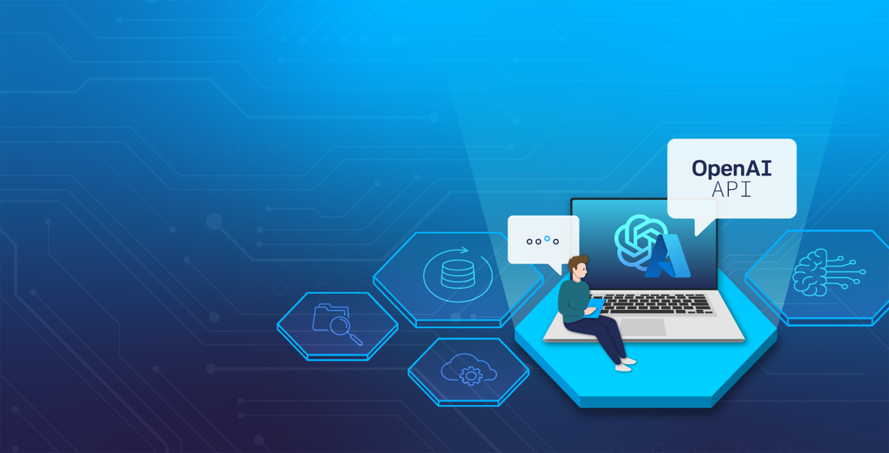

<!-- PROJECT SHIELDS -->
<!--
*** I'm using markdown "reference style" links for readability.
*** Reference links are enclosed in brackets [ ] instead of parentheses ( ).
*** See the bottom of this document for the declaration of the reference variables
*** for contributors-url, forks-url, etc. This is an optional, concise syntax you may use.
*** https://www.markdownguide.org/basic-syntax/#reference-style-links
-->
[![Contributors][contributors-shield]][contributors-url]
[![Forks][forks-shield]][forks-url]
[![Stargazers][stars-shield]][stars-url]
[![Issues][issues-shield]][issues-url]
[![MIT License][license-shield]][license-url]
[![LinkedIn][linkedin-shield]][linkedin-url]

<!-- ABOUT THE PROJECT -->
# A Hands-on Exploration of the Azure OpenAI API

<!-- GETTING STARTED -->

### 1. Introduction

This is part one of a five-part series developed by the Data Analytics Team at [Allgeier Schweiz](https://www.allgeier.ch/it-services/data-analytics/). The original implementation was part of a workshop for the [Swiss Data Science Conference](https://sds2024.ch/) of 2024.

You can also find the series in the Allgeier Schweiz [GitHub repository](https://github.com/AllgeierSchweiz/azure-openai-lab).

The following series showcases how to use the Azure OpenAI Service in Python by calling the Azure OpenAI REST API.

-   **[Part 1][A-Hands-on-Exploration-of-the-Azure-OpenAI-APIs-part-1]:** (this page) provides the readers with an overview of the workshop use case, what Azure OpenAI Service is, the language models used, the different techniques to enhance these models and the differences between Azure OpenAI and OpenAI.
-   **[Part 2][A-Hands-on-Exploration-of-the-Azure-OpenAI-APIs-part-2]** will show the readers the preparations required to start using the Azure OpenAI API in Python using GitHub Codespaces.
-   **[Part 3][A-Hands-on-Exploration-of-the-Azure-OpenAI-APIs-part-3]** will show the readers how to start using the Azure OpenAI API. Model enhancement techniques such as prompt engineering, zero-shot, one-shot, and few-shot learning will be implemented.
-   **[Part 4][A-Hands-on-Exploration-of-the-Azure-OpenAI-APIs-part-4]** will show the readers how to implement a retrieval strategy such as Retrieval-Augmented Generation (RAG) using the Azure OpenAI API together with LangChain and ChromaDB as the vector database. Additionally, the implementation of the Azure OpenAI Assistant API for data pre-processing of the data for RAG will also be showcased.
-   **[Part 5][A-Hands-on-Exploration-of-the-Azure-OpenAI-APIs-part-5]** will show the readers how to use fine-tuned model using the Azure OpenAI API and explore the implementation of RAG together with a fine-tuned model. Additionally, the implementation of the Azure OpenAI Assistant API for data pre-processing for fine-tuning will also be showcased.

(<a href="#readme-top">back to top</a>)

----------

### 2. Workshop Use Case

The use case of this series revolves around the [Food Fighters](https://github.com/AllgeierSchweiz/aihackers) concept created for [The Microsoft Fabric Global AI Hack](https://github.com/microsoft/Hack-Together-Fabric-AI) of 2024.

The solution aims to combat food waste by empowering users to effortlessly manage their food inventory, track food expiration dates, and receive personalized recipe suggestions via email, all with a simple product scan.

#### 2.1 Objectives

1.  We want the language model to create recipes from a list of ingredients we pass as the model input.
2.  To improve the recipes created by the model we will implement model enhancement techniques such as prompt engineering with zero-shot, one-shot and few-shot learning.
3.  To further improve the recipes created by the model, specifically creating vegan recipes in JSON format, we will implement an retrieval strategy called Retrieval Augmented Generation (RAG) using a CSV file of vegan recipes as our data foundation.
4.  To further improve the recipes created by the model we will implement an enhancement technique called Fine-Tuning to re-train the base language model using a CSV file of vegan recipes as our training data. Furthermore, we will explore the implementation of RAG together with a fine-tuned model.
5.  Before implementing the enhancement techniques listed in steps 3 and 4, we need to perform data preparation steps on the CSV file. To achieve this, we will use the Azure OpenAI Assistant API with the code interpreter functionality. This will allow us to conduct data-wrangling steps on the data based on our natural language inputs.

(<a href="#readme-top">back to top</a>)

----------

### 3. What is the Azure OpenAI Service?

The Azure OpenAI Service offers access to various large language models (LLMs), including GPT-4, GPT-4 Turbo with Vision, GPT-3.5-Turbo, and Embeddings model series. These are the same language models made available by [OpenAI](https://platform.openai.com/docs/models).

These models allow us to create written and image-based content, summarize information, do semantic searches, and natural language to code translations.

Users can utilize the Azure OpenAI Service through REST APIs, Python SDK, or the web-based interface provided in the Azure OpenAI Studio.

In our case, we will use the language models **GPT-4, GPT-3.5-Turbo,** and **Embeddings**. Each one will be called using the Azure OpenAI API.

#### 3.1 Azure OpenAI models being used

-   **GPT-4 (**_Version 0125-preview, Version 1106-preview)_: This model is used to create our assistant for code interpretation. The GPT-4 series is a set of models that improve on the GPT-3.5 and can understand and generate natural language and code. The latest version, **0125-preview**, supersedes its predecessor, version **1106-preview**,  offering enhanced performance in code generation, a reduction in instances of incomplete model tasks and [additional enhancements](https://learn.microsoft.com/en-us/azure/ai-services/openai/concepts/models#gpt-4-and-gpt-4-turbo-models).
-   **GPT-3.5-Turbo** _(Version 0125, Version 1106 and Version 0613):_ This model is used to create recipes based on a list of ingredients as our input prompt. GPT-3.5 models can understand and generate natural language or code. The most capable and cost-effective model in the GPT-3.5 family is the GPT-3.5 Turbo. The latest _0125_ version replaces the _1106_ and offers higher accuracy at responding in requested formats and general bug fixes. For Fine-Tuning, we will use version _0613_.
-   **Embeddings** _(text-embedding-3-large):_ This model is used to create an embedding of our recipe data which will be used to enhance our model output using Retrieval-Augmented Generation (RAG). An embedding is a compact, organized way to represent text information in numerical format using vectors. They are particularly useful in Artificial Intelligence applications, as it enables the essential meaning of text to be captured and transformed into a format that can be understood by an algorithm.

(<a href="#readme-top">back to top</a>)

----------

### 4. Enhancement Techniques

In this workshop we will showcase three key techniques for improving the language model’s output: prompt engineering, retrieval-augmented generation (RAG), and Fine-tuning.

  

[Approaches to AI: When to Use Prompt Engineering, Embeddings, or Fine-tuning | Entry Point AI](https://www.entrypointai.com/blog/approaches-to-ai-prompt-engineering-embeddings-or-fine-tuning/)

#### 4.1 Prompt Engineering

The model’s used in this workshop are prompt-based. With prompt-based models, the user interacts with the model by entering a text prompt i.e. text input, to which the model responds with a text completion. This completion is the model’s continuation of the input text i.e. text output.

Prompt engineering involves crafting a structurally optimized text prompt to guide and influence the model’s output. It aims to achieve the desired contextual and formatted response that aligns with the user’s model output expectations while minimizing the inherent biases of the underlying language model.

Depending on the objective, prompt engineering can serve as an alternative approach to more complex techniques like **Retrieval Augmented Generation (RAG)**  or  **Fine-Tuning**  by  providing the model with an example of the desired model output. This is where concepts like **one-shot** and  **few-shot learning** become relevant. We will learn more about these concepts in [Part 3][A-Hands-on-Exploration-of-the-Azure-OpenAI-APIs-part-3].

#### 4.2 Retrieval Augmented Generation

Retrieval Augmented Generation (RAG) is a retrieval strategy aimed at enhancing language models by providing them with supplementary information, a process also known as grounding. Rather than solely depending on the model’s existing knowledge, we can add proprietary data into the model prompt to guide it to a more precise and domain-specific response. It’s important to note that the model is **not** re-trained on the new data. The new data is only used as an additional prompt input, acting similarly to a one-shot learning.

In this workshop, we’ll be working with a new dataset — a CSV file filled with details about vegan recipes. By incorporating this particular dataset, our model should more accurately produce vegan recipes. We will learn more about these concepts in [Part 4][A-Hands-on-Exploration-of-the-Azure-OpenAI-APIs-part-4].

#### 4.3 Fine-Tuning

Fine-tuning is a technique used to re-train a pre-trained model using a new foundation of information i.e. training data, to suit a specific task.

Large Language Models (LLMs) possess extensive knowledge of diverse topics drawn from different data sources up until April 2023. This enables the model to address a wide array of problems, however, not every business requires a model capable of addressing an extensive range of topics simultaneously. Fine-tuning allows us to counteract this state, allowing the language model to become sharper in a specific knowledge domain.

In this workshop, we’ll be working with a new dataset — a CSV file filled with details about vegan recipes. By re-training the model with this dataset, our model will be able to generate recipes that are finely tailored to the provided prompt input. We will learn more about these concepts in [Part 5][A-Hands-on-Exploration-of-the-Azure-OpenAI-APIs-part-5]

(<a href="#readme-top">back to top</a>)

----------

### 5. Azure OpenAI vs. OpenAI

Azure OpenAI combines the security features of Microsoft Azure with the various language models developed by OpenAI. This means customers can benefit from Azure’s reliability and safety measures while using OpenAI’s technology. OpenAI is ideal for experimenting and exploring new functionalities. However, when it comes to professional applications, security, and compliance, choose Azure OpenAI.

Additionally, Azure OpenAI collaborates closely with OpenAI to develop the REST APIs. This partnership guarantees compatibility between the services and makes it easy for customers to switch between them with minimal hassle.

#### 5.1 Governance & Security

Azure OpenAI provides features like data encryption, access control, private networking, availability in different regions, and tools for responsible AI content filtering. In summary, it adds an extra layer of protection to your workload.

(<a href="#readme-top">back to top</a>)

----------

<!-- CONTACT -->
### 6. Questions, Feedback, Support?

Reach out to us! We are happy to answer any questions you might have or use your feedback to optimize this series!

- Nicolas Rehder - nrehder@allgeier.ch
- Alex Dean - adean@allgeier.ch

(<a href="#readme-top">back to top</a>)

----------

<!-- FILES -->
### 7. Documentation, Data & Support Files

Download and unzip the file on your local computer.

Have fun!

#### 7.1 Troubleshooting

- Use openai=1.12. Newest version is problematic. Especially with Assistant and Fine-Tuning.
- Embedding with Proxy API does **not** work. We'll need to fall back on the original Endpoint and API Key.
- Azure Openai Assistant not creating output file from transformation. Token limit needs to be increased.

(<a href="#readme-top">back to top</a>)

----------

<!-- REFERENCES -->
### 8.References

The following documentation was used to source the information contained in this workshop.

[1] [What is Azure OpenAI Service? — Azure AI services | Microsoft Learn](https://learn.microsoft.com/en-us/azure/ai-services/openai/overview)

[2] [Azure OpenAI Service — Features Overview and Key Concepts — Microsoft Community Hub](https://techcommunity.microsoft.com/t5/ai-azure-ai-services/azure-openai-service-features-overview-and-key-concepts/m-p/4055150)

[3] [Azure OpenAI Service models — Azure OpenAI | Microsoft Learn](https://learn.microsoft.com/en-us/azure/ai-services/openai/concepts/models)

[4] [Azure OpenAI Service deprecated models — Azure OpenAI | Microsoft Learn](https://learn.microsoft.com/en-us/azure/ai-services/openai/concepts/legacy-models)

[5] [Posten | Feed | LinkedIn](https://www.linkedin.com/feed/update/urn:li:activity:7165623330794938369/?updateEntityUrn=urn%3Ali%3Afs_updateV2%3A%28urn%3Ali%3Aactivity%3A7165623330794938369%2CFEED_DETAIL%2CEMPTY%2CDEFAULT%2Cfalse%29)

[6] [Fine-Tuning LLMs: Your Blueprint for Informed AI Choices! (substack.com)](https://snigdhasharma.substack.com/p/fine-tuning-llms-your-blueprint-for?r=1v8hnm&trk=public_post_comment-text)

[7] [Prompt Engineering Complete Guide | by Fareed Khan | Medium](https://medium.com/@fareedkhandev/prompt-engineering-complete-guide-2968776f0431)

[8] [Azure OpenAI Service — Azure OpenAI | Microsoft Learn](https://learn.microsoft.com/en-us/azure/ai-services/openai/concepts/prompt-engineering)

(<a href="#readme-top">back to top</a>)

<!-- MARKDOWN LINKS & IMAGES -->
<!-- https://www.markdownguide.org/basic-syntax/#reference-style-links -->
[contributors-shield]: https://img.shields.io/github/contributors/AllgeierSchweiz/openai-lab.svg?style=for-the-badge
[contributors-url]: https://github.com/AllgeierSchweiz/openai-lab/graphs/contributors
[forks-shield]: https://img.shields.io/github/forks/AllgeierSchweiz/openai-lab.svg?style=for-the-badge
[forks-url]: https://github.com/AllgeierSchweiz/openai-lab/network/members
[stars-shield]: https://img.shields.io/github/stars/AllgeierSchweiz/openai-lab.svg?style=for-the-badge
[stars-url]: https://github.com/AllgeierSchweiz/openai-lab/stargazers
[issues-shield]: https://img.shields.io/github/issues/AllgeierSchweiz/openai-lab.svg?style=for-the-badge
[issues-url]: https://github.com/AllgeierSchweiz/openai-lab/issues
[license-shield]: https://img.shields.io/github/license/AllgeierSchweiz/openai-lab.svg?style=for-the-badge
[license-url]: https://github.com/AllgeierSchweiz/openai-lab/blob/master/LICENSE.txt
[linkedin-shield]: https://img.shields.io/badge/-LinkedIn-black.svg?style=for-the-badge&logo=linkedin&colorB=555
[linkedin-url]: https://www.linkedin.com/in/nicolas-a-rehder/
[product-screenshot]: images/screenshot.png
[Next.js]: https://img.shields.io/badge/next.js-000000?style=for-the-badge&logo=nextdotjs&logoColor=white
[Next-url]: https://nextjs.org/
[React.js]: https://img.shields.io/badge/React-20232A?style=for-the-badge&logo=react&logoColor=61DAFB
[React-url]: https://reactjs.org/
[Vue.js]: https://img.shields.io/badge/Vue.js-35495E?style=for-the-badge&logo=vuedotjs&logoColor=4FC08D
[Vue-url]: https://vuejs.org/
[Angular.io]: https://img.shields.io/badge/Angular-DD0031?style=for-the-badge&logo=angular&logoColor=white
[Angular-url]: https://angular.io/
[Svelte.dev]: https://img.shields.io/badge/Svelte-4A4A55?style=for-the-badge&logo=svelte&logoColor=FF3E00
[Svelte-url]: https://svelte.dev/
[Laravel.com]: https://img.shields.io/badge/Laravel-FF2D20?style=for-the-badge&logo=laravel&logoColor=white
[Laravel-url]: https://laravel.com
[Bootstrap.com]: https://img.shields.io/badge/Bootstrap-563D7C?style=for-the-badge&logo=bootstrap&logoColor=white
[Bootstrap-url]: https://getbootstrap.com
[JQuery.com]: https://img.shields.io/badge/jQuery-0769AD?style=for-the-badge&logo=jquery&logoColor=white
[JQuery-url]: https://jquery.com 
[Creating-a-modern-data-lakehouse-zip]: https://github.com/AllgeierSchweiz/azure-data-lakehouse-lab/raw/main/Creating-a-Modern-Data-Lakehouse-with-Azure-Synapse.zip
[Creating-a-modern-data-lakehouse-pdf]: https://downgit.github.io/#/home?url=https://github.com/AllgeierSchweiz/azure-data-lakehouse-lab/blob/main/documentation/Creating-a-Modern-Data-Lakehouse-with-Azure-Synapse.pdf
[A-Hands-on-Exploration-of-the-Azure-OpenAI-APIs-part-1]: https://github.com/AllgeierSchweiz/azure-openai-lab/blob/main/series/A%20Hands-on%20Exploration%20of%20the%20Azure%20OpenAI%20API%20(Part%201%20of%C2%A05).md
[A-Hands-on-Exploration-of-the-Azure-OpenAI-APIs-part-2]: https://github.com/AllgeierSchweiz/azure-openai-lab/blob/main/series/A%20Hands-on%20Exploration%20of%20the%20Azure%20OpenAI%20API%20(Part%202%20of%C2%A05).md
[A-Hands-on-Exploration-of-the-Azure-OpenAI-APIs-part-3]: https://github.com/AllgeierSchweiz/azure-openai-lab/blob/main/series/A%20Hands-on%20Exploration%20of%20the%20Azure%20OpenAI%20API%20(Part%203%20of%C2%A05).md
[A-Hands-on-Exploration-of-the-Azure-OpenAI-APIs-part-4]: https://github.com/AllgeierSchweiz/azure-openai-lab/blob/main/series/A%20Hands-on%20Exploration%20of%20the%20Azure%20OpenAI%20API%20(Part%204%20of%C2%A05).md
[A-Hands-on-Exploration-of-the-Azure-OpenAI-APIs-part-5]: https://github.com/AllgeierSchweiz/azure-openai-lab/blob/main/series/A%20Hands-on%20Exploration%20of%20the%20Azure%20OpenAI%20API%20(Part%205%20of%C2%A05).md
[Creating-a-free-azure-account-part-1]: https://github.com/AllgeierSchweiz/azure-data-lakehouse-lab/blob/main/series/Creating%20a%20Free%20Azure%20Account%20(Part%201%20of%201).md
[FactProductCategoryPredictions-csv]: https://downgit.github.io/#/home?url=https://github.com/AllgeierSchweiz/azure-data-lakehouse-lab/blob/main/data/FactProductCategoryPredictions.csv
[FactProductSales-csv]: https://downgit.github.io/#/home?url=https://github.com/AllgeierSchweiz/azure-data-lakehouse-lab/blob/main/data/FactProductSales.csv
[FactProductSales-changes-csv]: https://downgit.github.io/#/home?url=https://github.com/AllgeierSchweiz/azure-data-lakehouse-lab/blob/main/data/changes/FactProductSales.csv
[Dataflow-zip]: https://downgit.github.io/#/home?url=https://github.com/AllgeierSchweiz/azure-data-lakehouse-lab/blob/main/support/pipeline/TransformDeltaFormat.zip
[Setup Bronze Database-sql]: https://downgit.github.io/#/home?url=https://github.com/AllgeierSchweiz/azure-data-lakehouse-lab/blob/main/support/notebooks/Setup-Bronze-Database.sql
[Setup Silver Database-ipynb]: https://downgit.github.io/#/home?url=https://github.com/AllgeierSchweiz/azure-data-lakehouse-lab/blob/main/support/notebooks/Setup-Silver-Database.ipynb
[Setup Gold Database-ipynb]: https://downgit.github.io/#/home?url=https://github.com/AllgeierSchweiz/azure-data-lakehouse-lab/blob/main/support/notebooks/Setup-Gold-Database.ipynb
